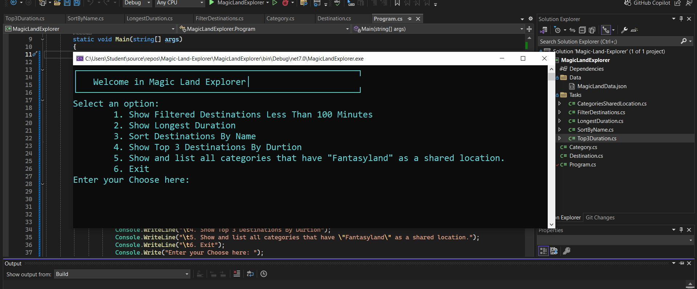

# Magic-Land-Explorer

Magic Land Explorer is a program on a console that enables users to discover and engage with different places in a magical world. The app reads and showcases data from an external JSON file with details on destinations categorized in various ways.

## Features

1. **Show Filtered Destinations Less Than 100 Minutes**: Displays destinations with a duration of less than 100 minutes.
2. **Show Longest Duration**: Displays the name of the destination with the longest duration.
3. **Sort Destinations By Name**: Sorts and displays destinations alphabetically by their name.
4. **Show Top 3 Destinations By Duration**: Displays the top 3 destinations with the longest durations.
5. **Show Categories with Shared Location 'Fantasyland'**: Lists all categories that have "Fantasyland" as a shared location.

## Output

